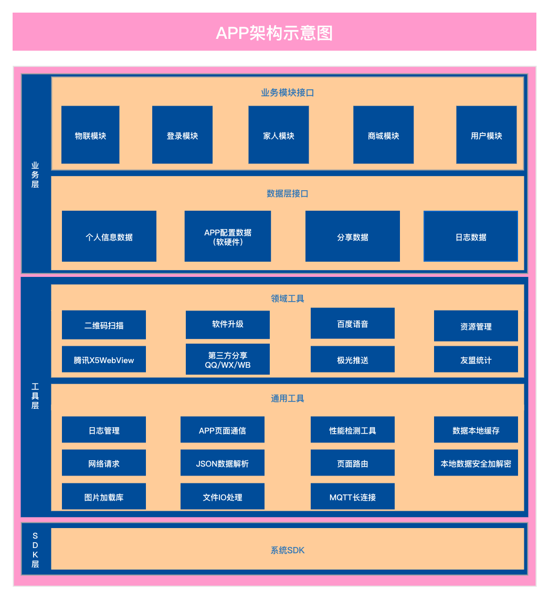
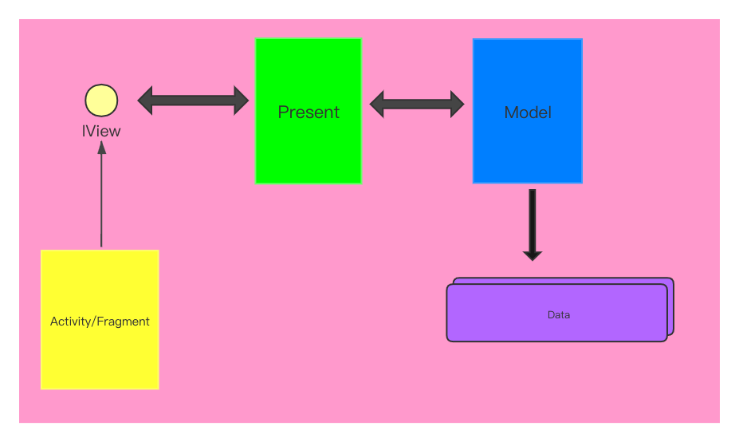
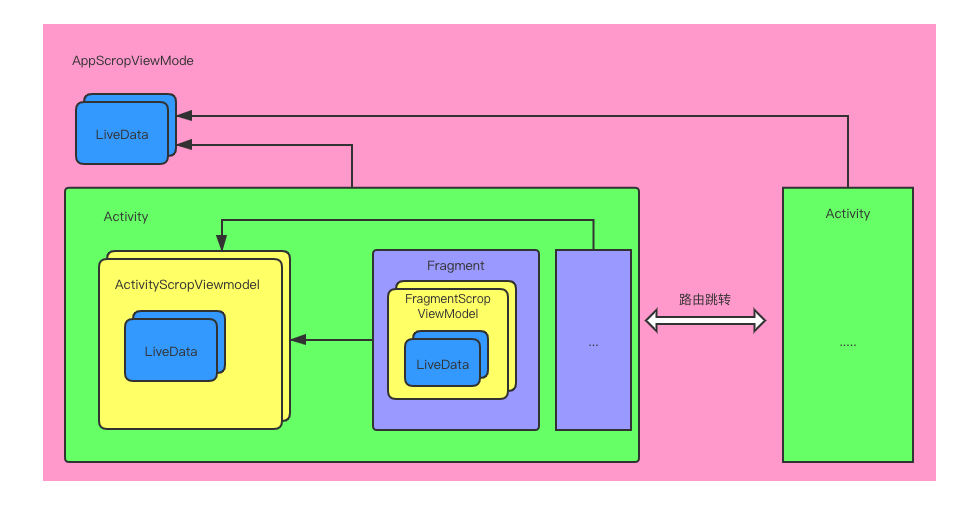

# 项目背景
随着智能生活概念的传播、普及，人们对智能家电的需求越来越多，要求也越来越高。传统的遥控器或者触屏控制家电设备的方式，受限于距离已经无法满足用户的需求了。智家App不仅能满足用户超远距离程控制设备的需求，还能让用户在手机上看到设备当下的运行状况。如果家中的家电设备能够与环境联动，甚至能和其他设备联动，对用户来说将是多么省事，多么智能啊。智家App提供了这样一种可能，用户可以通过App为绑定的设备指定一个场景任务，其中的场景可以跟环境有关也可以和其他绑定的设备有关，当场景满足设定条件设备就会去执行规定任务。
# 整体架构

### 架构说明
1. 架构分三层，从上向下依次为业务层、工具层、SDK层
   * 业务层：包含各个业务模块和相应的数据；
   * 组件层：基础组件封装，包含通用工具和领域工具；
   * SDK层：系统API；
2. 上下层级之间单向依赖；
3. 同层级之间使用接口通信；
4. 通过MQTT长连接实时展示设备状态；
4. 基于腾讯X5WebView的良好兼容性，APP采用原生+H5的方式实现；          
5. 通过ViewModel+LiveData实现页面间的数据传输；
6. 通过Arouter实现跨模块间的跳转；
# MVP架构
   
### MVP说明
模块内的页面架构基于MVP实现：
1. Model：指的是数据请求单元，作用是请求数据（网络、本地缓存）；
2. IView：View逻辑的抽象，抽象的作用是能通过动态代理解决View生命周期一致性问题；
3. Present：Model层和View层之间的桥梁，主要任务是发起数据请求和触发View数据填充；
# 页面间的通信

### 详细说明
ViewModel和LiveData属于Jetpack中的库，配合LifeCycle能较好的解决组件间生命周期一致性问题，同时通过实现LiveData数据的单向依赖能方便且快速追溯数据源。
目前框架按组件的生命周期指定ViewModel作用域：
* AppScropViewModel属于Application，全局唯一，其含有的LiveData可以为任意组件提供数据通信服务；
* ActivitScropViewModel属于某个Activity，生命周期与Activity一致。其含有的LiveData可以为页面中的View和Fragment提供数据通信服务，同时在系统层面ViewModel能保证Activity异常重建情况下数据不发生丢失；
* FragmentScropViewModel属于某个Fragment，生命周期与Fragment一致，其含有的LiveData可以为页面中的View提供数据通信服务；
