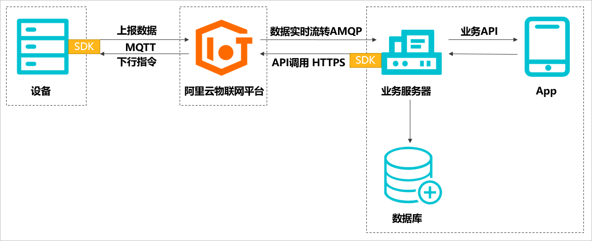
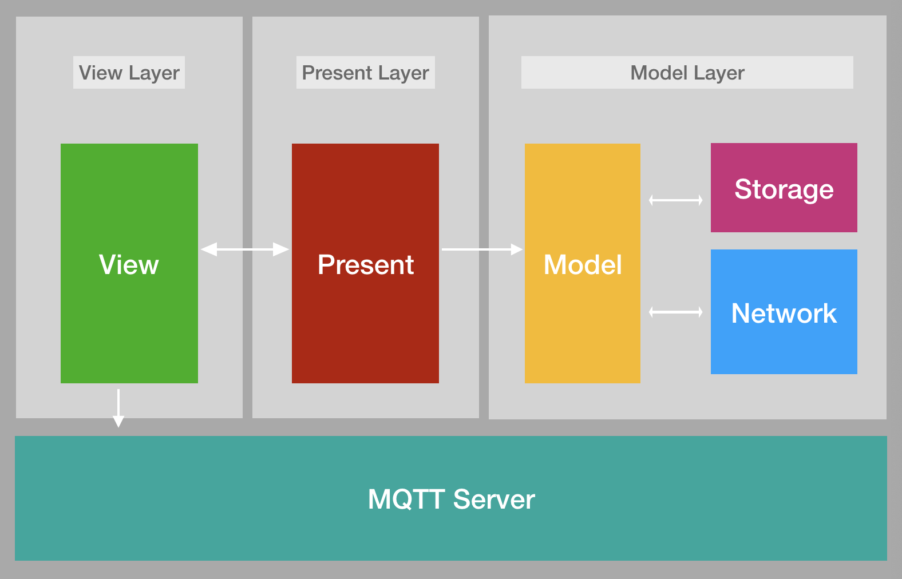

# 背景：
智能时代下如何搭建安全稳定的Android客户端框架

# 一、智能家居App架构基本模块
智能家居App面向的对象除了自有服务器，用户，还需要面向物联网服务器以及设备。物联模块对于智能家居App来说是必不可少的模块。模块职责主要有以下几个方面：
1. 提供稳定、高效设备配网能力；
2. 提供app控制设备、实时接收设备属性变化；
3. 安全能力；

## 1.1 物联网平台消息通信流程
	
<br/>
#### 上行数据链路
* 设备通过MQTT协议与物联网平台建立长连接，上报数据（通过Publish发布Topic和Payload）到物联网平台。
* 可配置规则引擎，编写SQL对上报数据进行处理，并配置转发规则，将处理后的数据转发到RDS、表格存储、函数计算、TSDB、企业版实例内的时序数据存储、DataHub、消息队列RocketMQ等云产品中，或通过AMQP消费组流转到您的ECS服务器上。
#### 下行指令链路
* ECS业务服务器调用基于HTTPS协议的API接口Pub，给Topic发送指令，将数据发送到物联网平台。
* 物联网平台通过MQTT协议，使用Publish发送数据（指定Topic和Payload）到设备端。

## 1.2 设备配网方式
设备配网指的是将路由器的Wi-Fi SSID和PASSWORD通过某种方式传递到终端设备，让终端设备可以接入Wi-Fi网络的过程。
对于无屏设备采用一建配网的方案，只需用户在App上输入Wi-Fi的密码即可。配网流程如下：

1. 手机通过广播发送Wi-Fi热点的SSID/密码信息。
2. 设备通过监听方式获取，并连接上网。

## 1.3 安全能力
#### 物联网平台提供多重防护，有效保障设备和云端数据的安全。
* ### 身份认证
1. 提供芯片级安全存储方案（ID²）及设备密钥安全管理机制，防止设备密钥被破解。安全级别很高。
2. 提供一机一密的设备认证机制，降低设备被攻破的安全风险。适合有能力批量预分配设备证书（ProductKey、DeviceName和DeviceSecret），将设备证书信息烧录到每个设备的芯片。安全级别高。
3. 提供一型一密的设备认证机制。设备预烧产品证书（ProductKey和ProductSecret），认证时动态获取设备证书（包括ProductKey、DeviceName和DeviceSecret）。适合批量生产时无法将设备证书烧录每个设备的情况。安全级别普通。
4. 提供X.509证书的设备认证机制，支持基于MQTT协议直连的设备使用X.509证书进行认证。安全级别很高。
* ### 通信安全
1. 支持TLS（MQTT、HTTPS）、DTLS（CoAP）数据传输通道，保证数据的机密性和完整性，适用于硬件资源充足、对功耗不是很敏感的设备。安全级别高。
2. 支持设备权限管理机制，保障设备与云端安全通信。
3. 支持设备级别的通信资源（Topic等）隔离，防止设备越权等问题。  
#### 物联模块提供也提供了身份认证和通信安全。
* ### 身份认证
1. Apk认证，通过App ID向物联网平台注册得到秘钥和签名。保证唯一App使用权。
2. 自有账号体系对接基于auth 2.0 API协议。使用自己的账号体系和物联平台关联，实现设备绑定关系、设备分享、设备消息推送等功能。自有账户体系中的用户信息不会保留在物联平台上，保障用户隐私信息。
* ### 通信安全
1. 实现TLS（MQTT、HTTPS）数据传输。

# 二、智家Android客户端演进之路
智家App两年时间主要经历了3个大版本的演化，经历了从单一进程到多进程再到动态化方案的过程。我们一直有打造性能监控基础组件的想法，通过发现和解决迭代过程中的性能问题，使得我们的性能优化组件趋向成熟。

## 1.0版本，麻雀虽小五脏俱全。  
<br/>
第一个版本由一个人用了2个多月时间开发出来的，当时物联网平台不够稳定加上相应的文档不够完善、资源有限开发同学刚接触物联网经验不足，大部分时间用来联调设备和学习物联知识。为了满足上线排期，只保留了核心功能的实现。如上图所示，采用MVP作为页面架构。整个App由5个左右的Activity，一些成熟的三方开源框架加上登录模块和物联模块组成。当时国内安卓5.0以下的手机占比小于5%，加上产品统计到的客户群体中安卓5.0版本以下的手机占比小于0.1%，因此直接将最小的适配版本设为5.0，这省去了低版本UI的适配时间，也免去了解决低版本性能问题的时间。一些开源框架在世面上经历了多年的千锤百炼，已经非常成熟，在对比后选择了OkHttp作为网络基础模块，Glide作为图片加载模块，AutoSize作为屏幕适配模块。考虑到今后团队的发展、测试的效率、编译速度等方面的影响，同时为了避免重复造轮子，我们觉得组件化和模块化带来的开发效率损耗不值一提，于是采用了组件化和模块化的架构方案。
## 2.0版本，业务模块暴增，性能问题频发。
第一版本趋向稳定之后，产品经理积压的需求终于排山倒海的来了。从物联模块，到家人模块、语音识别模块、IM模块再到商城模块，这个阶段的我们将全部的精力和时间都放在了新功能扩展上，新的Activity、新的Present、新的Model，一个个功能就这样实现了，代码量、内存占用、安装包体积也在迅速膨胀。
### 启动优化：
排在首位的影响就是冷启动速度太长。许多框架模块在启动阶段都需要初始化，物联模块和用户模块需要请求网络完成登录，广告页面需要请求广告图片，页面路由库初始化需要解析Dex生成路由表等等，在低端手机启动时间甚至会达到10秒。通过对业务的梳理优化，将物联模块移到子进程中，将用户模块的登录请求移到首页显示之后进行，首页数据用之前缓存的数据展示，广告页的图片不再请求网络，而是通过用户使用App期间悄悄缓存的广告图片。对于异步任务，通过配置依赖关系生成依赖树，将存在依赖关系的框架模块放在同一个异步任务初始化。最终的成果保证了在低端手机的启动时间在5秒以内。
优化后的多进程架构变成了这样：
 <br/>  
### ANR稳定性优化：
随着用户接入的设备越多，一些用户开始反馈App频繁发生ANR情况，通过ANR日志的抓取、分析，定位到的问题函数都没有执行耗时操作，甚至有的“问题”函数里面只有几个页面赋值语句，这让我们一度陷入怀疑人生的境地。通过阅读源码，进一步了解系统ANR产生的原因以及ANR日志生成的时机，我们知道ANR日志只会在发生ANR的时候记录下当前的线程堆栈，这看起来很准确，但是结合ANR产生的判断就能发现系统的不严谨性。以广播超时ANR为例子，系统发出广播前会生成一个10s的延迟异步任务，在发送广播后开启异步任务，广播在10s内执行完成返回后系统解除异步任务，如果广播执行超时则抛出ANR。由于Android线程之间通信是通过Handler机制实现的，异步发送的广播要执行的话最终会塞入主线程的消息队列，当消息队列排满了消息，广播的执行时间就会延迟，而当延迟时间达到10秒，系统之前设下的异步任务开始执行ANR，此时主线程的堆栈被打印，记录下的并不一定是耗时的函数。了解系统的缺陷后，我们针对主线程的消息队列做了小小的监控，对队列中执行的消息做了相应的聚合，当同一类型的消息连续聚集到一定时间的时候，发出即将发生ANR的通知，从而采取相应措施防止ANR发生。
### 其他优化
* 内存优化：内存问题往往需要使用一段时间才会出现，所以我们以监控为主。监控的对象主要有资源类对象的关闭，内存中图片的情况(是否存在大图片、重复图片)。定时查看堆内存的占用情况，发现内存超过触顶值，打印堆内存文件定位内存问题。
* 包体积优化：除了资源图片格式转为webp，还做了resource.arsc文件的混淆，替换效率更高的编译工具和混淆工具，最终40M安装包减少到20M，减少了50%的体积。

## 3.0版本，公司策略调整，框架需要扩展动态化方案。  
公司一开始决定只接入自家的空气净化器和加湿器两款产品，后来由于小厨电也打算走上智能化的道路，App需要针对小厨点开发一套功能页面。对于这个变化，我们其实最开始是有考虑到的，设备的控制页面和展示页面是根据产品的改变而改变的，但一开是人数不多、项目紧张、加湿器和空气净化器的页面差别不大，再加上项目经理确认了不会有其他产品加入。调研了阿里公版智能App、米家、小京鱼等业内其他智能家居App，我们决定用RN来作为动态化的解决方案。 

# 三、整体架构
先看看看看模块化的整体设计图  
<br/>
## 3.1 MVP设计
先来看一下MVC、MVP、MVVM大概的优缺点：
|  | MVC |MVP|MVVM|
| ----- | ----- |-----|-----|
| 优点 | 开发速度快|方便测试、View和Model之间解耦|数据驱动view的更新，低耦合|
| 缺点 | 业务复杂的时候严重影响迭代速度 |View和Present相互持有，存在生命周期一致性问题、业务复杂会造成Present臃肿|数据绑定导致出现Bug不好定位 |
 
由图表可以看出在Android框架设计中，MVC更适合页面逻辑简单，业务相对稳定的应用。MVVM最大的特点是数据驱动，数据的变化直接体现在View上减少了被引用的情况，碍于当时Android的开发环境对数据绑定的支持有限，而且对于数据绑定的bug没有很好的处理方案。从项目现在和未来的规划中，我们否认了MVC的架构方式，由于MVVM当时的不成熟放弃了MVVM。项目的业务会越来越复杂，但是只要保证业务逻辑和页面逻辑相互隔离不混乱，带来的代码臃肿还是能接受的，针对存在的生命周期一致性问题，解决方案很成熟而且实现简单。从这两点来看MVP符合当下以及将来的项目情况。为此我们设计实现了如下图的MVP架构：
<br/>
<!-- * View Layer: 只负责UI的绘制呈现，包含Fragment和一些自定义的UI组件，View层需要实现ViewInterface接口。Activity在项目中不再负责View的职责，仅仅是一个全局的控制者，负责创建View和Presenter的实例；
* Model Layer: 负责检索、存储、操作数据，包括来自网络、数据库、磁盘文件和SharedPreferences的数据；
* Presenter Layer: 作为View Layer和Module Layer的之间的纽带，它从model层中获取数据，然后调用View的接口去控制View；
* Contract: 我们参照Google的demo加入契约类Contract来统一管理View和Presenter的接口，使得某一功能模块的接口能更加直观的呈现出来，这样做是有利于后期维护的。 -->
这套MVP架构还为我们带来了一个额外的好处：我们有了足够明确的开发规范和标准。细致到了每一个类应该放到哪个包下，哪个类具体应该负责什么职责等等。这对于我们的Code Review、接手他人的功能模块等都提供了极大的便利
### MVP问题的解决方案
MVP存在的生命周期一致性问题指的是：Presenter的生命周期比View生命周期长，View的提前结束会导致内存泄漏。我们用可以在View生命周期结束后解绑Presenter，但这种情况下的粗暴解绑很容易造成空指针异常。为此我们让View实现了ViewInterface，Presenter不再持有View的实例而是持有ViewInterface的动态代理对象，这样Presenter在更新View之前就拥有了拦截的机会，也就解决了问题。
## 3.2组件化与模块化
基础组件与业务无关且相对独立，可以复用避免重复造轮子。模块化更多的是考虑到并行开发和测试效率。智家App的模块化设计图如下：
  
<br/>
整个项目分为三层，从下往上分别是：
* Basic Component Layer: 基础组件层，顾名思义就是一些基础组件，包含了各种开源库以及和业务无关的各种自研工具库；
* Business Component Layer: 业务组件层，这一层的所有组件都是业务相关的；
* Business Module Layer: 业务module层，在Android Studio中每块业务对应一个单独的module。Module都必须准遵守前面提到的MVP架构。

同时针对模块化也需定义了一些自己的游戏规则:
* 对于Business Module Layer，各业务模块之间的通讯跳转采用路由框架ARouter来实现;
* 对于Business Component Layer，单一业务组件只能对应某一项具体的业务，对于有个性化需求的对外部提供接口让调用方定制;
* 各Layer间严禁反向依赖，横向依赖关系由各业务Leader和技术小组商讨决定。  

对于模块化项目，每个单独的business module都可以单独编译成APK。在开发阶段需要单独打包编译，项目发布的时候又需要它作为项目的一个module来整体编译打包。简单的说就是开发时是application，发布时是library。因此需要你在business module的gradle配置文件中加入如下代码：
```
if(isBuildModule.toBoolean()){
    apply plugin: 'com.android.application'
}else{
    apply plugin: 'com.android.library'
}
```
# 世面上其他App架构的优缺点
这边我简单的把市面上的App架构归结为两种:超级App架构、单一App架构。
### 超级App架构

这边我简单的把市面上的App架构归结为两种:超级App架构、单一App架构。
# 结尾
以上就是我对于智家App架构的整理，有很多不足，但也让我得到了成长。感恩！
 

