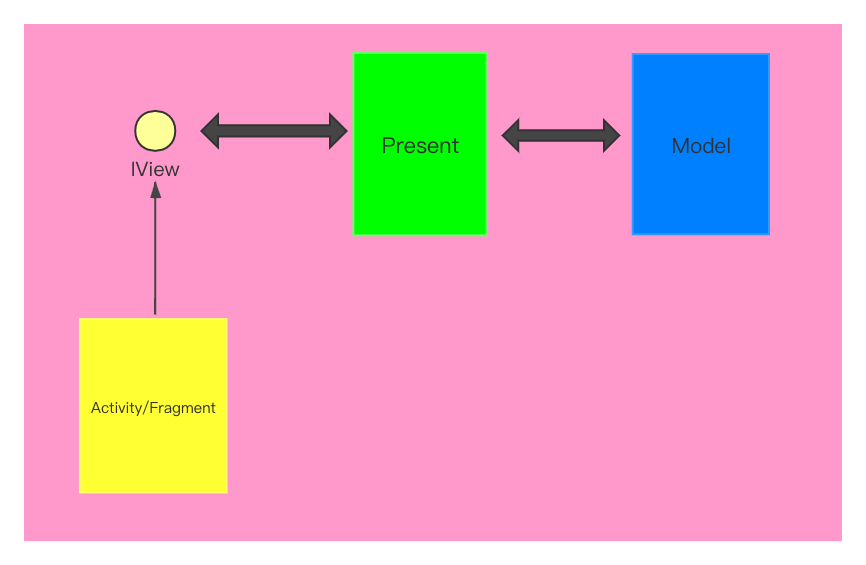

# 项目背景
随着智能生活概念的传播、普及，人们对智能家电的需求越来越多，要求也越来越高。传统的遥控器或者触屏控制家电设备的方式，受限于距离已经无法满足用户的需求了。智家App不仅能满足用户超远距离程控制设备的需求，还能让用户在手机上看到设备当下的运行状况。如果家中的家电设备能够与环境联动，甚至能和其他设备联动，对用户来说将是多么省事，多么智能啊。智家App提供了这样一种可能，用户可以通过App为绑定的设备指定一个场景任务，其中的场景可以跟环境有关也可以和其他绑定的设备有关，当场景满足设定条件设备就会去执行规定任务。
# 整体架构

# MVP架构

# 页面间的通信

