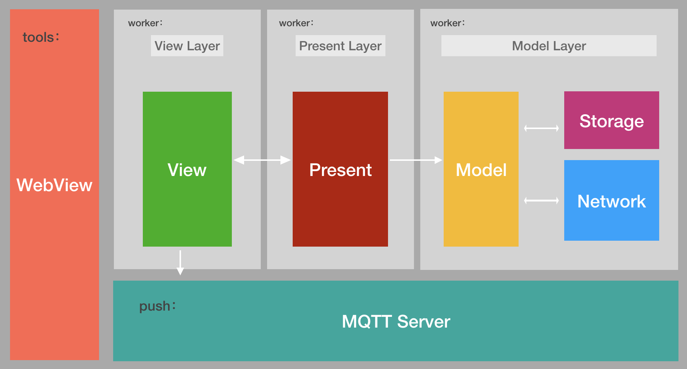
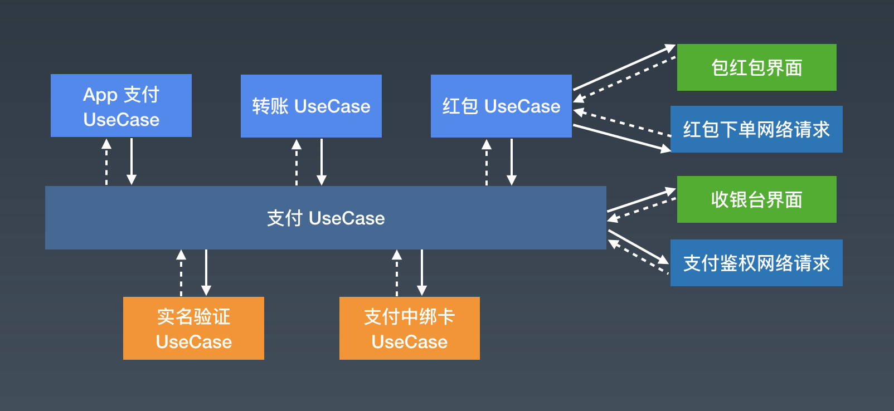

# 背景：
智能时代下如何搭建安全稳定的Android客户端框架

# 一、现有架构
### 1、MVP
先来看一下MVC、MVP、MVVM大概的优缺点：

|      | MVC                                                          | MVP                                                          | MVVM                                                         |
| ---- | ------------------------------------------------------------ | ------------------------------------------------------------ | ------------------------------------------------------------ |
| 优点 | Android一开始是往MVC方向去设计页面架构的，开发者只需指定好Model就能快速实现页面，无需做其他设计。 | 将业务逻辑独立出来抽象成Presenter，可以针对Presenter做功能测试。Presenter作为中间层，解耦了View和Model | 通过给view进行数据绑定，每当数据发生变化，能驱动View的更新，这个过程不需要依赖其他角色。 |
| 缺点 | Activity并不是一个标准的MVC模式中的Controller，随着界面及其逻辑的复杂度不断提升，Activity类的职责不断增加，以致变得庞大臃肿，难以维护 | View和Present相互持有，存在生命周期一致性问题、业务复杂会造成Present臃肿 | Android是通过databinding来实现View和数据之间的绑定，databinding作为新出的框架，还不太成熟。 |

从项目现在和未来的规划中，我们否认了MVC的架构方式，由于MVVM当时的不成熟放弃了MVVM。项目的业务会越来越复杂，但是只要保证业务逻辑和页面逻辑相互隔离不混乱，带来的代码臃肿还是能接受的，针对存在的生命周期一致性问题，解决方案很成熟而且实现简单。从这两点来看MVP符合当下以及将来的项目情况。为此我们设计实现了如下图的MVP架构：
<br/>
这套MVP架构还为我们带来了一个额外的好处：我们有了足够明确的开发规范和标准。细致到了每一个类应该放到哪个包下，哪个类具体应该负责什么职责等等。这对于我们的Code Review、接手他人的功能模块等都提供了极大的便利

#### MVP问题的解决方案
MVP存在的生命周期一致性问题指的是：Presenter的生命周期比View生命周期长，View的提前结束会导致内存泄漏。我们用可以在View生命周期结束后解绑Presenter，但这种情况下的粗暴解绑很容易造成空指针异常。为此我们让View实现了ViewInterface，Presenter不再持有View的实例而是持有ViewInterface的动态代理对象，这样Presenter在更新View之前就拥有了拦截的机会，也就解决了问题。
#### 项目MVP架构存在的缺陷
按照MVP的职责划分来看，Model负责请求数据，作为View层的Activity负责控制页面逻辑，而其他任务都交给了Presenter层，它负责发起数据、负责处理数据返回后的管理（分页，数据对比等），还要负责发起页面更新。业务量复杂到一定程度Presenter也终将变得臃肿难以维护。
### 2、多进程
 <br/>
Android系统分配给进程的资源是有限的，当进程占用的资源达到阈值会触发lmk杀掉优先级低的组件。推送和物联模块长连接作为后台服务，在系统资源紧张的时候容易被杀掉。为了解决这个问题，我们根据轻重进程分离的思想将推送和物联模块放在:push进程中。又因为webview本身的不稳定和内存泄漏问题，我们将它独立到:tool进程中去，其他模块则在:work进程中运行。分离后的 push 进程内存占用以及被系统kill回收的几率大幅降低，而对于tools进程，我们不再要求其一定存在，只在用户收到消息，或者进入h5相关功能界面时存在即可。

### 3、动态化页面

设备的控制面板和展示页面是根据产品的改变而改变的，如下图两种不同产品的展示页：


随着接入的产品种类越多，产品展示页的形式也就越多，如果采用传统方式提前写好所有页面进行展示页面的一一适配，那将面临新接入一个产品就要重新发版本的尴尬境界，更糟糕的是用户不一定会去升级最新版本。所有我们亟需一种具有动态适配设备展示页面的技术。

####技术选型

在动态化的持续发展中，不少大厂都推出了自己的动态化方案。

|      | H5容器                                                       | React Native                                                 | 插件化                                                       |
| ---- | ------------------------------------------------------------ | ------------------------------------------------------------ | ------------------------------------------------------------ |
| 原理 | 基于`WebView+JsBridge`来实现动态化                           | 由本地 JavascriptCore 引擎对 JS 文件进行解析，并利用 Bridge 映射到对应的 Native 方法和 UI 控件 | 通过对四大组件的Hook等方案，动态下发业务模块，实现动态化更新 |
| 优势 | WebView是Android的基础组件，接入成本低                       | 只需要开发者做基本的配置，就可以只通过Javascript来实现大部分功能，对于移动端的依赖减到最小，只要写一份代码，就可以在多个平台上运行。 | 能满足动态化需求，甚至能有动态化更新的能力。                 |
| 弊端 | H5的性能无论如何是比不过Native。对于重性能的场景下比如复杂动画，适合用Native开发 | RN背后是繁多的Js与Native通信，对于普通页面还好，但对于大型列表等复杂页面则会出现较为严重的性能瓶颈 | 需要在清单文件预留组件。随着Android越来越规范，Hook组件的方式可能面临兼容性问题。 |

#### 最终选择与缺陷

在调研了阿里物联公版App、智能涂鸦、米家App等成熟的智能家居App之后，发现他们全部采用React Native的方式来动态化扩展产品展示页面。基于性能方面的考虑（RN性能损耗相比较H5来的小）和对Hook技术的不稳定，我们选择了和其他智能家居App一样的方案。


# 二、别的优秀app架构设计思路与优缺点
在想不到设计方案，或者拿捏不了架构好坏的时候，我们应该跳出“环境”，看看其他优秀架构的设计思路。分析他们的优缺点，避免自己陷入闭门造车。以下两个优秀app方案带给我新的思路。

### 1.微信支付UseCase

微信支付流程多，界面跳转复杂，传统的MV(X)模式忽略了业务流程（ViewController和ViewContrller之间该怎么跳转）。

### 架构设计思路：业务流程抽象

<br/>

将业务流程抽象为一个独立的角色 `UseCase`。同时, 把界面抽象为 `UIPage`。 一个大的业务流程可以分解为一个个小的业务流程。

####  优点

* 业务流程的代码能够聚合到 UseCase 中，而不是分散各个 ViewController，Activity 中。

* 业务流程和界面得到了复用。

* 契合微信支付多流程，界面跳转复杂的业务特点

### 2.饿了么EMC架构

饿了么移动APP从单一APP发展为多APP齐头并进的格局。需要快速复用业务组件。

### 架构设计思路：业务模块注册机制

E(Excalibur)M(Modules)C(Common)。

<br/>

每个业务模块对外提供相应的业务接口，同时在系统启动的时候向Excalibur系统注册自己模块的Scheme（Excalibur是饿了么移动用来保存Scheme与模块之间映射的系统，同时能根据Scheme进行Class反射返回）。 当其他业务模块对该业务模块有依赖时，从Excalibur系统中获取相关实例，并调用相应接口来实现调用，从而实现了业务模块之间的解耦目的。

### 优点

* 高可用：保证了组件复用的同时，保留了原本组件的架构方案。
* 低耦合，避免了业务组件之间的直接依赖。

#### 缺点

* 需要手动注册模块Scheme
* class会带来性能损耗  

# 三、架构优化点

衡量架构好坏的标准有很多比如，安全性、可扩展性、高内聚低耦合等，但这些标准都需要建立在完成业务需求的基础上。业务需求的更新迭代，能使得架构体现出更高的标准。在各个版本的迭代中我们做了以下几个架构优化：

### 1.物联安全优化

智能家电需要通过网络连接服务器，从而实现远程控制。设备连接网络过程、控制命令下发过程都有可能受到劫持的风险，进而引发设备故障甚至家庭安全。为此我们借用阿里生活物联网平台提供的强大能力，针对设备、链路、用户等做了全面的安全保障。

* 为设备提供芯片级安全存储方案及设备密钥安全管理机制，防止设备密钥被破解。

* 对于设备提供一机一密的设备认证机制，降低设备被攻破的安全风险。批量预分配设备证书（ProductKey、DeviceName和DeviceSecret），将设备证书信息烧录到每个设备的芯片。

* 提供X.509证书的设备认证机制，支持基于MQTT协议直连的设备使用X.509证书进行认证。

* 对设备通信资源（Topic）隔离，防止设备越权等问题。

* Apk认证，通过App ID向物联网平台注册得到秘钥和签名。保证唯一App使用权。

* 自有账号体系对接基于auth 2.0 API协议。使用自己的账号体系和物联平台关联，实现设备绑定关系、设备分享、设备消息推送等功能。自有账户体系中的用户信息不会保留在物联平台上，保障用户隐私信息。

### 2.App安全优化

从用户信息安全和App自身代码的安全方面，我们的架构以下几个优化：

* 相关日志(操作路径、内存文件等)收集的时候剔除用户敏感信息，剔除不了的进行加密再写入日志文件。
* 对于需要存在磁盘的数据，进行相应的加密。
* 对于核心的加密算法下层到C/C++，以动态链接库的方式调用。
* 编译生成Apk的时候对代码进行混淆，提升反编译难度。

### 3.性能优化

在智家App1.x~2.x的过程中，爆发过几次性能问题。有些是业务突然爆炸式增加，有些是对业务场景考虑不周到，有些是Android系统设计缺陷导致的。针对这些情况，我们主要做了启动优化、ANR优化、内存监控、包体积优化

* 启动优化：许多框架模块在启动阶段都需要初始化，物联模块和用户模块需要请求网络完成登录，广告页面需要请求广告图片，路由库初始化需要解析Dex生成路由表等等，在低端手机启动时间甚至会达到10秒。通过对业务梳理进行延迟初始化，使用提前缓存的数据进行数据展示，对于异步任务，通过配置依赖关系生成依赖树，将存在依赖关系的框架放在同一个异步任务初始化。最终的成果保证了在低端手机的启动时间在5秒以内。
* ANR优化：通过聚合主线程消息队列中特定消息的执行耗时，当耗时累计3秒的时候，限制设备属性变更消息的下发速度。避免了App在连接多台设备情况下，频繁下发页面变更消息从而导致的ANR问题。
* 内存监控：监控的对象主要有资源类对象的关闭，内存中图片的情况(是否存在大图片、重复图片)。通过定时查看堆内存的占用情况发现内存超过触顶值，打印堆内存文件定位内存问题。
* 包体积优化：除了资源图片格式转为webp，还做了resource.arsc文件的混淆，替换效率更高的编译工具和混淆工具，最终40M安装包减少到20M，减少了50%的体积。


# 四、整体架构
先看看看看模块化的整体设计图  
<br/>
## 组件化与模块化
基础组件与业务无关且相对独立，可以复用避免重复造轮子。模块化更多的是考虑到并行开发和测试效率。智家App的模块化设计图如下：
  
<br/>
整个项目分为三层，从下往上分别是：
* Basic Component Layer: 基础组件层，顾名思义就是一些基础组件，包含了各种开源库以及和业务无关的各种自研工具库；
* Business Component Layer: 业务组件层，这一层的所有组件都是业务相关的；
* Business Module Layer: 业务module层，在Android Studio中每块业务对应一个单独的module。Module都必须准遵守前面提到的MVP架构。

同时针对模块化也需定义了一些自己的游戏规则:
* 对于Business Module Layer，各业务模块之间的通讯跳转采用路由框架ARouter来实现;
* 对于Business Component Layer，单一业务组件只能对应某一项具体的业务，对于有个性化需求的对外部提供接口让调用方定制;
* 各Layer间严禁反向依赖，横向依赖关系由各业务Leader和技术小组商讨决定。  

对于模块化项目，每个单独的business module都可以单独编译成APK。在开发阶段需要单独打包编译，项目发布的时候又需要它作为项目的一个module来整体编译打包。简单的说就是开发时是application，发布时是library。因此需要你在business module的gradle配置文件中加入如下代码：
```
if(isBuildModule.toBoolean()){
    apply plugin: 'com.android.application'
}else{
    apply plugin: 'com.android.library'
}
```

# 五、架构的未来优化思路与方向 
# 结尾
以上就是我对于智家App架构的整理，以及对App架构的一些粗浅看法，有很多不足，但也让我得到了成长。感恩！
 

