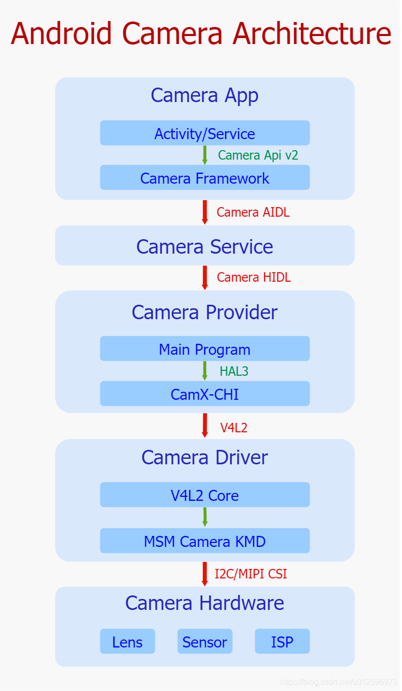
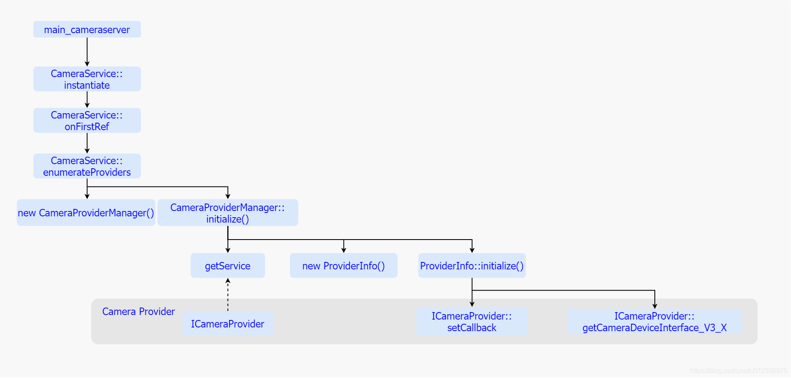
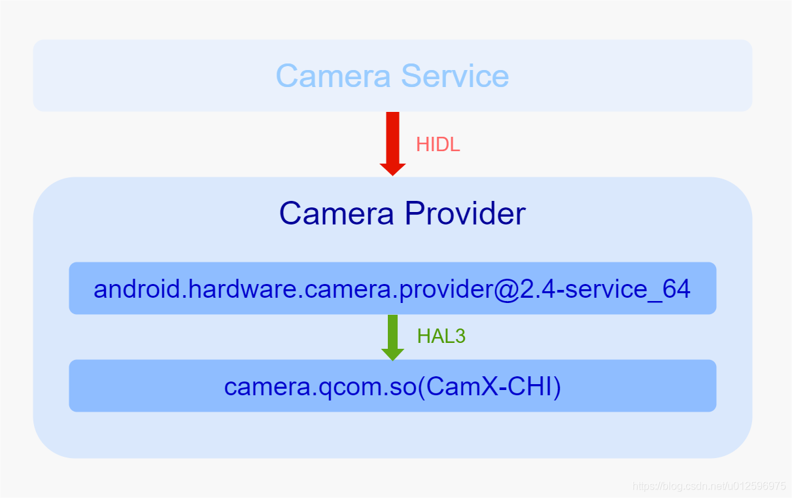
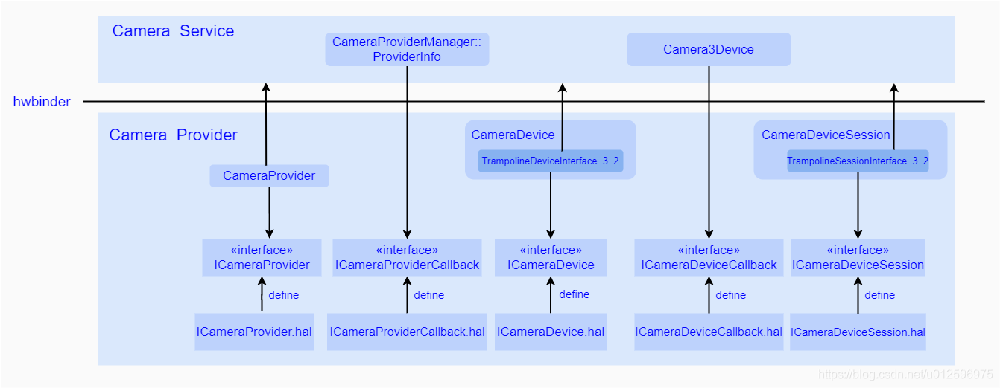
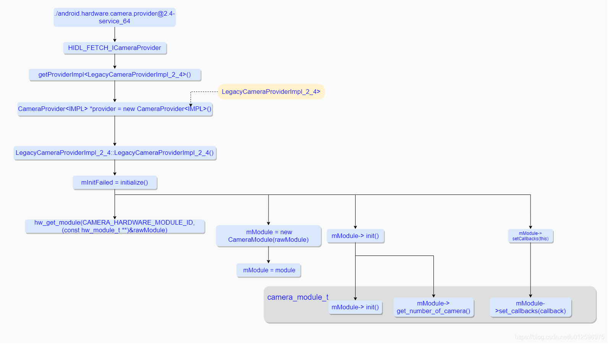
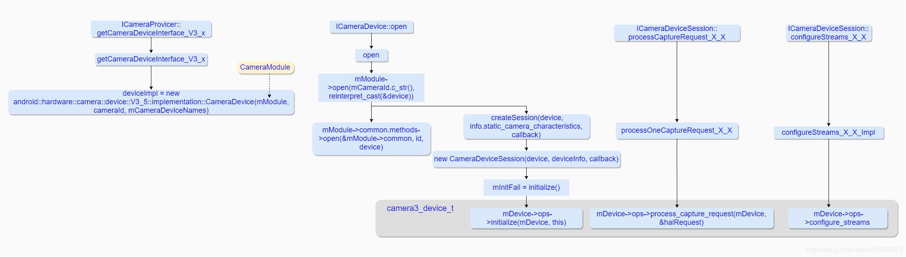
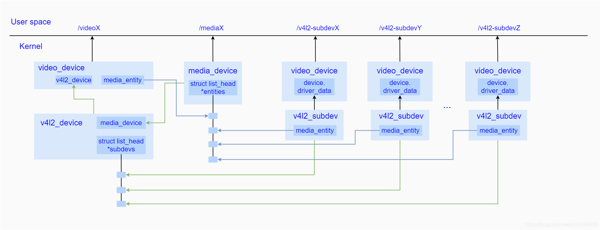
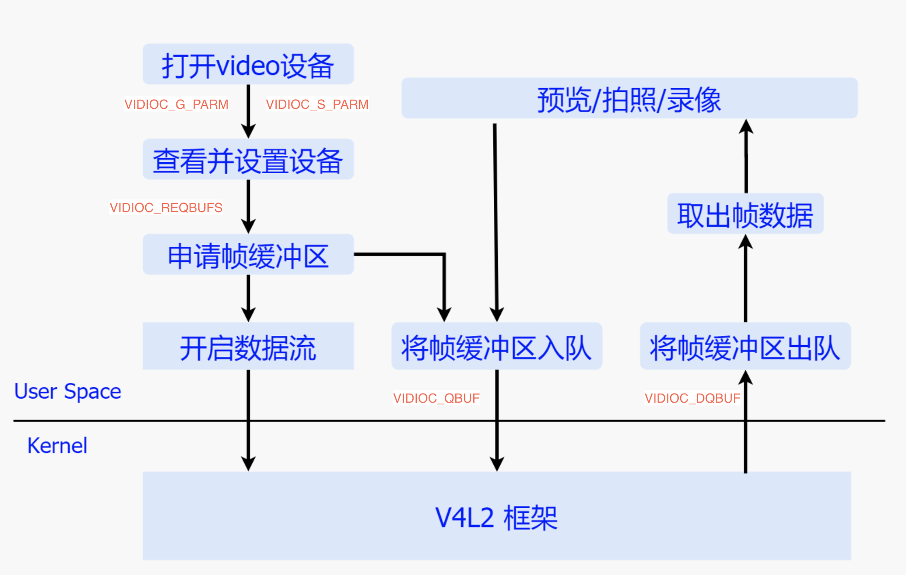

# 背景
# 安卓相机架构概览
安卓相机架构采用分层思想，下面的相机整体架构图很清晰地显示出了五层架构以及相互的关联接口：




# 一、应用层

应用层处于整个框架的最上层，以相机应用呈现给用户。用户通过应用满足需求，而应用的功能实现需要调用一系列的Camera Api接口，具体的接口实现放在了Camera Framework中来完成。

### 1.1 Camera Api v2 & Camera Framework

Camera Api v1提供的几个标准方法(预览、拍照、录像)无法精确的控制底层硬件，无法满足应用场景的多元化。于是谷歌在Android5.0提出了Camera Api v2，支持了更多特性，比如逐帧控制曝光、感光度以及支持Raw格式的输出等。为了更加细致化地控制相机系统，Api v2将复杂的相机系统行为抽象成不同的接口类以及接口方法，主要有一下几个类：

#### CameraManager

作为一个系统服务，主要用于检测以及打开系统相机。除此之外，还能提供当前Camera 设备支持的属性信息。

#### CameraCaptureSession

代表了一个具体的相机会话，建立了与相机设备的通道，而之后对于相机设备的控制都是通过该通道来完成的。当需要进行预览或者拍照时，首先通过该类创建一个Session，并且调用其startRepeatingRequest方法开启预览流程，或者调用capture方法开始一次拍照动作。

#### CameraDevice.StateCallback

主要用于返回创建Camera设备的结果，一旦创建成功相机框架会通过回调其onOpened方法将CameraDevice实例给到App，如果失败，则调用onError返回错误信息。

#### CameraCaptureSession.StateCallback

主要用于返回创建CameraCaptureSession的结果，成功则通过onConfigured方法返回一个CameraCaptureSession实例，如果失败则通过onConfigureFailed返回错误信息。

#### CameraCaptureSession.CaptureCallback

用于返回来自Camera Framework的数据和事件，其中onCaptureStarted方法在下发图像需求之后立即被调用，告知App此次图像需求已经收到；onCaptureProgressed方法在产生部分元数据的时候回调；onCaptureCompleted方法在图像采集完成，上传meta data数据时被调用。

#### CaptureRequest

该类用于表示一次图像请求，在需要进行预览或者拍照时，都需要创建一个CaptureRequest，并且可以针对图片的一系列诸如曝光/对焦设置参数都加入到该Request中，通过CameraCaptureSessin下发到相机系统中。

#### TotalCaptureResult

每当通过CameraDevice完成了一次CaptureRequest之后会生成一个TotalCaptureResult对象，该对象包含了此次抓取动作所产生的所有信息，其中含有关于硬件模块(包括Sensor/lens/flash)的配置信息以及相机设备的状态信息等。

#### CaptureResult

代表了某次抓取动作最终生成的图像信息，其中包括了此次关于硬件软件的配置信息以及输出的图像数据，以及显示了当前Camera设备的状态的元数据(meta data)，该类并不保证拥有所有的图像信息。

# 二、服务层

服务层位于Camera Framework层与Camera Provider层之间。Framework通过AIDL向Camera Service请求服务，Camera Service收到请求后通过HIDL将请求转发给Camera Provider，最终Camera Service通过回调拿到结果并将结果返回给Framework。所以此处我们重点关注AIDL以及Camera Service 主程序的实现。

### 2.1.Camera AIDL 接口

CameraService向外暴露的AIDL接口主要有一下几个：


ICameraService.aidl定义了ICameraService 接口，实现主要通过CameraService类来实现，主要接口如下：

> getNumberOfCameras： 获取系统中支持的Camera 个数
>
> connectDevice()：打开一个Camera 设备
>
> addListener(): 添加针对Camera 设备以及闪光灯的监听对象 

ICameraDeviceCallbacks.aidl文件中定义了ICameraDeviceCallbacks接口，其实现主要由Framework中的CameraDeviceCallbacks类进行实现，主要接口如下：

> onResultReceived： 一旦Service收到结果数据，便会调用该接口发送至Framework
>
> onCaptureStarted()： 一旦开始进行图像的采集，便调用该接口将部分信息以及时间戳上传至Framework
>
> onDeviceError(): 一旦发生了错误，通过调用该接口通知Framework

ICameraDeviceUser.aidl定义了ICameraDeviceUser接口，由CameraDeviceClient最终实现，主要接口如下：

> disconnect： 关闭Camera 设备
>
> submitRequestList：发送request
>
> beginConfigure： 开始配置Camera 设备，需要在所有关于数据流的操作之前
>
> endConfigure： 结束关于Camera 设备的配置，该接口需要在所有Request下发之前被调用
>
> createDefaultRequest： 创建一个具有默认配置的Request

ICameraServiceListener.aidl定义了ICameraServiceListener接口，由Framework中的CameraManagerGlobal类实现，主要接口如下：

> onStatusChanged： 用于告知当前Camera 设备的状态的变更

### 2.2 Camera Service 主程序

CameraService 主程序，随着系统启动而运行。主要目的是向外暴露AIDL接口，同时通过调用Camera Provider的HIDL接口，建立与Provider的通信。同时在内部维护了从Framework以及Provider获取到的资源，并且按照一定的框架结构保持整个Service在稳定高效的状态下运行，所以接下来我们主要通过几个关键类、初始化过程以及处理来自App的请求三个部分来详细介绍下。

#### 关键类解析


#### 启动初始化

首先我们看看CameraService是怎么运行起来的：



当系统启动的时候会运行main_cameraserver程序，紧接着调用了CameraService的instantiate方法，该方法最终会调用到CameraService的onFirstRef方法，在这个方法里面便开始了整个CameraService的初始化工作。 
而在onFirstRef方法内又调用了enumerateProviders方法，该方法中主要做了两个工作：

* 一个是实例化一个CameraProviderManager对象，该对象管理着有关Camera Provider的一些资源。 
* 一个是调用CameraProviderManager的initialize方法对其进行初始化工作。

而在CameraProviderManager初始化的过程中，主要做了三件事：

* 首先通过getService方法获取ICameraProvider代理。
*  随后实例化了一个ProviderInfo对象，之后调用其initialize方法进行初始化。
*  最后将ProviderInfo加入到一个内部容器中进行管理。

而在调用ProviderInfo的initialize方法进行初始化过程中存在如下几个动作：

* 首先接收了来自CameraProviderManager获取的ICameraProvider代理并将其存入内部成员变量中。
*  其次由于ProviderInfo实现了ICameraProviderCallback接口，所以紧接着调用了ICameraProvider的setCallback将自身注册到Camera Provider中，接收来自Provider的事件回调。
* 再然后，通过调用ICameraProvider代理的getCameraDeviceInterface_V3_X接口，获取Provider端的ICameraDevice代理，并且将这个代理作为参数加入到DeviceInfo3对象实例化方法中，而在实例化DeviceInfo3对象的过程中会通过ICameraDevice代理的getCameraCharacteristics方法获取该设备对应的属性配置，并且保存在内部成员变量中。
*  最后ProviderInfo会将每一个DeviceInfo3存入内部的一个容器中进行统一管理，至此整个初始化的工作已经完成。

通过以上的系列动作，Camera Service进程便运行起来了，获取了Camera Provider的代理，同时也将自身关于Camera Provider的回调注册到了Provider中，这就建立了与Provider的通讯，另一边，通过服务的形式将AIDL接口也暴露给了Framework，静静等待来自  Framework的请求。

### 2.3 处理App请求

相机应用被打开后，首先要调用Camera Api的openCamera方法，经过Framework的内部处理，最终进入到CameraService中。CameraService内部主要做了获取相机设备属性，打开相机设备，之后会回调到App中去，App拿到返回的相机设备，再次下发创建Session以及下发Request请求。

#### 获取属性

由于在Camera Service启动初始化的时候已经获取了相应相机设备属性配置，并存储在DeviceInfo3中，所有直接返回DeviceInfo3中的属性即可。

#### 打开相机设备 

对于打开相机设备动作，主要由connectDevice来实现，内部实现比较复杂，接下来我们详细梳理下。 当CameraFramework通过调用ICameraService的connectDevice接口的时候，主要做了两件事情：

* 一个是创建CameraDeviceClient。
*  一个是对CameraDeviceClient进行初始化，并将其给Framework。

而其中创建CameraDevcieClient的工作是通过makeClient方法来实现的，在该方法中首先实例化一个CameraDeviceClient，并且将来自Framework针对ICameraDeviceCallbacks的实现类CameraDeviceImpl.CameraDeviceCallbacks存入CameraDeviceClient中，这样一旦有结果产生便可以将结果通过这个回调回传给Framework，其次还实例化了一个Camera3Device对象。

其中的CameraDeviceClient的初始化工作是通过调用其initialize方法来完成的，在该方法中：

* 首先调用父类Camera2ClientBase的initialize方法进行初始化。
*  其次实例化FrameProcessorBase对象并且将内部的Camera3Device对象传入其中，这样就建立了FrameProcessorBase和Camera3Device的联系，之后将内部线程运行起来，等待来自Camera3Device的结果。 
* 最后将CameraDeviceClient注册到FrameProcessorBase内部，这样就建立了与CameraDeviceClient的联系。

而在Camera2ClientBase的intialize方法中会调用Camera3Device的intialize方法对其进行初始化工作，并且通过调用Camera3Device的setNotifyCallback方法将自身注册到Camera3Device内部，这样一旦Camera3Device有结果产生就可以发送到CameraDeviceClient中。

而在Camera3Device的初始化过程中，首先通过调用CameraProviderManager的openSession方法打开并获取一个Provider中的ICameraDeviceSession代理，其次实例化一个HalInterface对象，将之前获取的ICameraDeviceSession代理存入其中，最后将RequestThread线程运行起来，等待Request的下发。

而对于CameraProviderManager的openSession方法，它会通过内部的DeviceInfo保存的ICameraDevice代理，调用其open方法从Camera Provider中打开并获取一个ICameraDeviceSession远程代理，并且由于Camera3Device实现了Provider中ICameraDeviceCallback方法，会通过该open方法传入到Provider中，接收来自Provider的结果回传。

至此，整个connectDevice方法已经运行完毕，此时App已经获取了一个Camera设备，紧接着，由于需要采集图像，所以需要再次调用CameraDevice的createCaptureSession操作，到达Framework，再通过ICameraDeviceUser代理进行了一系列操作，分别包含了cancelRequest/beginConfigure/deleteStream/createStream以及endConfigure方法来进行数据流的配置。

#### 配置数据流 

其中cancelRequest逻辑比较简单，对应的方法是CameraDeviceClient的cancelRequest方法，在该方法中会去通知Camera3Device将RequestThread中的Request队列清空，停止Request的继续下发。

deleteStream/createStream 分别是用于删除之前的数据流以及为新的操作创建数据流。

紧接着调用位于整个调用流程的末尾–endConfigure方法，该方法对应着CameraDeviceClient的endConfigure方法，其逻辑比较简单，在该方法中会调用Camera3Device的configureStreams的方法，而该方法又会去通过ICameraDeviceSession的configureStreams_3_4的方法最终将需求传递给Provider。

到这里整个数据流已经配置完成，并且App也获取了Framework中的CameraCaptureSession对象，之后便可进行图像需求的下发了，在下发之前需要先创建一个Request，而App通过调用CameraDeviceImpl中的createCaptureRequest来实现，该方法在Framework中实现，内部会再去调用Camera Service中的AIDL接口createDefaultRequest，该接口的实现是CameraDeviceClient，在其内部又会去调用Camera3Device的createDefaultRequest方法，最后通过ICameraDeviceSession代理的constructDefaultRequestSettings方法将需求下发到Provider端去创建一个默认的Request配置，一旦操作完成，Provider会将配置上传至Service，进而给到App中。

#### 处理图像需求 

在创建Request成功之后，便可下发图像采集需求了，这里大致分为两个流程，一个是预览，一个拍照，两者差异主要体现在Camera Service中针对Request获取优先级上，一般拍照的Request优先级高于预览，具体表现是当预览Request在不断下发的时候，来了一次拍照需求，在Camera3Device 的RequestThread线程中，会优先下发此次拍照的Request。这里我们主要梳理下下发拍照request的大体流程：

下发拍照Request到Camera Service，其操作主要是由CameraDevcieClient的submitRequestList方法来实现，在该方法中，会调用Camera3Device的setStreamingRequestList方法，将需求发送到Camera3Device中，而Camera3Device将需求又加入到RequestThread中的RequestQueue中，并唤醒RequestThread线程，在该线程被唤醒后，会从RequestQueue中取出Request，通过之前获取的ICameraDeviceSession代理的processCaptureRequest_3_4方法将需求发送至Provider中，由于谷歌对于processCaptureRequest_3_4的限制，使其必须是非阻塞实现，所以一旦发送成功，便立即返回，在App端便等待这结果的回传。

#### 接收图像结果 

针对结果的获取是通过异步实现，主要分为两个部分，一个是事件的回传，一个是数据的回传，而数据中又根据流程的差异主要分为Meta Data和Image Data两个部分，接下来我们详细介绍下：

在下发Request之后，首先从Provider端传来的是Shutter Notify，因为之前已经将Camera3Device作为ICameraDeviceCallback的实现传入Provider中，所以此时会调用Camera3Device的notify方法将事件传入Camera Service中，紧接着通过层层调用，将事件通过CameraDeviceClient的notifyShutter方法发送到CameraDeviceClient中，之后又通过打开相机设备时传入的Framework的CameraDeviceCallbacks接口的onCaptureStarted方法将事件最终传入Framework，进而给到App端。

在Shutter事件上报完成之后，当一旦有Meta Data生成，Camera Provider便会通过ICameraDeviceCallback的processCaptureResult_3_4方法将数据给到Camera Service，而该接口的实现对应的是Camera3Device的processCaptureResult_3_4方法，在该方法会通过层层调用，调用sendCaptureResult方法将Result放入一个mResultQueue中，并且通知FrameProcessorBase的线程去取出Result，并且将其发送至CameraDeviceClient中，之后通过内部的CameraDeviceCallbacks远程代理的onResultReceived方法将结果上传至Framework层，进而给到App中进行处理。

随后Image Data前期也会按照类似的流程走到Camera3Device中，但是会通过调用returnOutputBuffers方法将数据给到Camera3OutputStream中，而该Stream中会通过BufferQueue这一生产者消费者模式中的生产者的queue方法通知消费者对该buffer进行消费，而消费者正是App端的诸如ImageReader等拥有Surface的类，最后App便可以将图像数据取出进行后期处理了。


# 三、硬件抽象层

硬件抽象层就是对Linux内核驱动程序的封装，向上提供接口，屏蔽低层的实现细节。也就是说，把对硬件的支持分成了两层，一层放在用户空间，一层放在内核空间，其中，硬件抽象层运行在用户空间，而Linux内核驱动程序运行在内核空间。Android分出硬件抽象层的原因是为了隐藏具体的硬件逻辑，从商业的角度看保护了相关厂家的利益。

### 3.1 Camera HAL3 接口

HAL基本结构hw_module_t，hw_device_t只有open和close方法很难满足Camera这样复杂的设备。因此谷歌通过将这两个基本结构嵌入到更大的结构体内部，同时在更大的结构内部定义了各自模块特有的方法，扩展了HAL接口。运用该方法针对Camera提出了HAL3接口。HAL3接口包括了用于代表一系列操作主体的结构体以及具体操作函数，接下来我们分别进行详细介绍：

### 3.2 核心结构体解析

#### camera_module_t以及camera3_device_t

```c++
typedef struct camera_module {
    hw_module_t common;
    int (*get_number_of_cameras)(void);
    int (*get_camera_info)(int camera_id, struct camera_info *info);
    int (*set_callbacks)(const camera_module_callbacks_t *callbacks);
    void (*get_vendor_tag_ops)(vendor_tag_ops_t* ops);
    int (*open_legacy)(const struct hw_module_t* module, const char* id, uint32_t halVersion, struct hw_device_t** device);
    int (*set_torch_mode)(const char* camera_id, bool enabled);
    int (*init)();
    int (*get_physical_camera_info)(int physical_camera_id, int (*is_stream_combination_supported)(int camera_id,const camera_stream_combination_t *streams);
    int (*is_stream_combination_supported)(int camera_id, const camera_stream_combination_t *streams);
    void (*notify_device_state_change)(uint64_t deviceState);
} camera_module_t;
  
 
typedef struct camera3_device {
    hw_device_t common;
    camera3_device_ops_t *ops; //拓展接口，Camera HAL3定义的标准接口
    void *priv;
} camera3_device_t;
```

#### camera3_stream_configuration

```c++
//该结构体主要用来代表配置的数据流列表，内部装有上层需要进行配置的数据流的指针
typedef struct camera3_stream_configuration {
    uint32_t num_streams;//代表了来自上层的数据流的数量，其中包括了output以及input stream。
    camera3_stream_t **streams;//是streams的指针数组，包括了至少一条output stream以及至多一条input stream。
    uint32_t operation_mode;//当前数据流的操作模式，该模式在camera3_stream_configuration_mode_t中被定义，HAL通过这个参数														//可以针对streams做不同的设置。
    const camera_metadata_t *session_parameters;//该参数可以作为缺省参数，直接设置为NULL即可，       CAMERA_DEVICE_API_VERSION_3_5以上的版本才支持
} camera3_stream_configuration_t;
```


#### camera3_stream_t

```c++
//该结构体主要用来代表具体的数据流实体，在整个的配置过程中，需要在上层进行填充，当下发到HAL中后，HAL会针对其中的各项属性进行配置
typedef struct camera3_stream {
    int stream_type;//表示数据流的类型，类型在camera3_stream_type_t中被定义。
    uint32_t width;//表示当前数据流中的buffer的宽度。
    uint32_t height;//表示当前数据流中buffer的高度。
    int format;//表示当前数据流中buffer的格式，该格式是在system/core/include/system/graphics.h中被定义。
    uint32_t usage;//表示当前数据流的gralloc用法，其用法定义在gralloc.h中。
    uint32_t max_buffers;//指定了当前数据流中可能支持的最大数据buffer数量。
    void *priv;
    android_dataspace_t data_space;//指定了当前数据流buffer中存储的图像数据的颜色空间。
    int rotation;//指定了当前数据流的输出buffer的旋转角度，其角度的定义在camera3_stream_rotation_t中，该参数由Camera 											//Service进行设置，必须在HAL中进行设置，该参数对于input stream并没有效果。
    const char* physical_camera_id;//指定了当前数据流从属的物理camera Id。
}camera3_stream_t;
```


#### camera3_stream_buffer_t

```c++
//该结构体主要用来代表具体的buffer对象
typedef struct camera3_stream_buffer {
    camera3_stream_t *stream;//代表了从属的数据流
    buffer_handle_t *buffer//buffer句柄
    int status;
    int acquire_fence;
    int release_fence;
} camera3_stream_buffer_t;
```

#### 3.3 核心接口函数解析

HAL3的核心接口都是在camera3_device_ops中被定义，该结构体定义了一系列的函数指针，用来指向平台厂商实际的实现方法，接下来就其中几个方法简单介绍下：

```c++
typedef struct camera3_device_ops {
    int (*initialize)(const struct camera3_device *, const camera3_callback_ops_t *callback_ops);
    int (*configure_streams)(const struct camera3_device *, camera3_stream_configuration_t *stream_list);
    int (*register_stream_buffers)(const struct camera3_device *,const camera3_stream_buffer_set_t *buffer_set);
    const camera_metadata_t* (*construct_default_request_settings)(const struct camera3_device *, int type);
    int (*process_capture_request)(const struct camera3_device *, camera3_capture_request_t *request);
    void (*get_metadata_vendor_tag_ops)(const struct camera3_device*, vendor_tag_query_ops_t* ops);
    void (*dump)(const struct camera3_device *, int fd);
    int (*flush)(const struct camera3_device *);
    void (*signal_stream_flush)(const struct camera3_device*, uint32_t num_streams, const camera3_stream_t* const* streams);
    int (*is_reconfiguration_required)(const struct camera3_device*, const camera_metadata_t* 				    old_session_params, const camera_metadata_t* new_session_params);
} camera3_device_ops_t;
```

##### initialize：

该方法必须在camera_module_t中的open方法之后，其它camera3_device_ops中方法之前被调用，主要用来将上层实现的回调方法注册到HAL中，并且根据需要在该方法中加入自定义的一些初始化操作。

#### configure_streams：

该方法在完成initialize方法之后，在调用process_capture_request方法之前被调用，主要用于重设当前正在运行的Pipeline以及设置新的输入输出流。

#### construct_default_request_settings：

该方法主要用于构建一系列默认的Camera Usecase的capture 设置项，通过camera_metadata_t来进行描述，其中返回值是一个camera_metadata_t指针，其指向的内存地址是由HAL来进行维护的，同样地，该方法需要在1ms内返回，最长不能超过5ms。

#### process_capture_request：

该方法用于下发单次新的capture request到HAL中， 上层必须保证该方法的调用都是在一个线程中完成，而且该方法是异步的，同时其结果并不是通过返回值给到上层，而是通过HAL调用另一个接口process_capture_result()来将结果返回给上层的，在使用的过程中，通过in-flight机制，保证短时间内下发足够多的request，从而满足帧率要求。

#### dump：

该方法用于打印当前Camera设备的状态，一般是由上层通过dumpsys工具输出debug dump信息或者主动抓取bugreport的时候被调用，该方法必须是非阻塞实现。

#### flush：

当上层需要执行新的configure_streams的时候，需要调用该方法去尽可能快地清除掉当前已经在处理中的或者即将处理的任务，为配置数据流提供一个相对稳定的环境，flush会在所有的buffer都得以释放，所有request都成功返回后才真正返回。

### 3.4 回调函数

上面的一系列方法是上层直接对下控制Camera Hal，而一旦Camera Hal产生了数据或者事件的时候，可以通过camera3_callback_ops中定义的回调方法将数据或者事件返回至上层，该结构体定义如下：

```c++
typedef struct camera3_callback_ops {
void (*process_capture_result)(const struct camera3_callback_ops *, const camera3_capture_result_t *result);
void (*notify)(const struct camera3_callback_ops *, const camera3_notify_msg_t *msg);
  
camera3_buffer_request_status_t (*request_stream_buffers)(
    const struct camera3_callback_ops *,
    uint32_t num_buffer_reqs,
    const camera3_buffer_request_t *buffer_reqs,
    /*out*/uint32_t *num_returned_buf_reqs,
    /*out*/camera3_stream_buffer_ret_t *returned_buf_reqs);
  
void (*return_stream_buffers)( const struct camera3_callback_ops *, uint32_t num_buffers, const camera3_stream_buffer_t* const* buffers);
} camera3_callback_ops_t;
```

其中常用的回调方法主要有两个：

#### process_capture_result

该方法用于返回HAL部分产生的metadata和image buffers，它与request是多对一的关系，同一个request，可能会对应到多个result，比如可以通过调用一次该方法用于返回metadata以及低分辨率的图像数据，再调用一次该方法用于返回jpeg格式的拍照数据，而这两次调用时对应于同一个process_capture_request动作。同一个Request的Metadata以及Image Buffers的先后顺序无关紧要，但是同一个数据流的不同Request之间的Result必须严格按照Request的下发先后顺序进行依次返回的，如若不然，会导致图像数据显示出现顺序错乱的情况。

#### notify

该方法用于异步返回HAL事件到上层，必须非阻塞实现。

### 2.Camera Provider

Android8.0Treble项目中，加入了Camera Provider这一抽象层，该层作为一个独立进程存在于整个系统中，并且通过HIDL成功地将Camera Hal Module从Camera Service中解耦出来，承担起了对Camera HAL的封装工作。在相机架构中，Camera Provider处于Camera Service和硬件抽象层之间。Camera Service通过HIDL请求Camera Provider，Camera Provider调用HAL3接口去控制相机。



#### 2.1Camera HIDL 接口

HIDL(接口定义语言)，其核心是接口的定义，而谷歌为了使开发者将注意力落在接口的定义上而不是机制的实现上，主动封装了HIDL机制的实现细节，开发者只需要通过*.hal文件定义接口，填充接口内部实际的实现即可，接下来来看下具体定义的几个主要接口：



#### ICameraProvider.hal

在Camera Provider启动的时候被实例化。主要接口如下：

> getCameraDeviceInterface_V3_x: 该方法主要用于Camera Service获取ICameraDevice，通过该对象可以控制Camera 设备的诸如配置数据流、下发request等具体行为。
> setCallback： 将Camera Service 实现的ICameraProviderCallback传入Camera Provider，一旦Provider有事件产生时便可以通过该对象通知Camera Service。

#### ICameraProviderCallback.hal：

在Camera Service 启动的时候被实例化，通过调用ICameraProvider::setCallback接口注册到Camera Provider中。其主要接口如下：

> cameraDeviceStatusChange： 将Camera 设备状态上传至Camera Service，状态由CameraDeviceStatus定义

#### ICameraDevice.hal源码如下：

其主要接口如下:

> open： 用于创建一个Camera设备，并且将Camera Service中继承ICameraDeviceCallback并实现了相应接口的Camera3Device作为参数传入Provider中，供Provider上传事件或者图像数据。
> getCameraCharacteristics：用于获取Camera设备的属性。

#### ICameraDeviceCallback.hal


通过调用ICameraDevice::open方法注册到Provider中，其主要接口如下：

> processCaptureResult_3_4: 一旦有图像数据产生会通过调用该方法将数据以及meta data上传至Camera Service。
> notify: 通过该方法上传事件至Camera Service中，比如shutter事件等。

#### ICameraDeviceSession.hal

其主要接口如下：

> constructDefaultRequestSettings：用于创建默认的Request配置项。
> configureStreams_3_5：用于配置数据流，其中包括了output buffer/Surface/图像格式大小等属性。
> processCaptureRequest_3_4：下发request到Provider中，一个request对应着一次图像需求。
> close: 关闭当前会话。

### 2.2Camera Provider 主程序

接下来进入到Provider内部去看看，整个进程是如何运转的，以下图为例进行分析:



*  在系统初始化的时候，启动Provider进程并加入HWServiceManager中。

* 在启动Provider进程过程中，获取并保存camera_module_t结构体、当前支持的相机数量。同时往硬件抽象实现层传入回调。
* 监听来自CameraService的调用。

接下来以上图为例简单介绍下Provider中几个重要流程：



* Camera Service请求相机信息：通过调用ICameraProvider接口获取ICameraDevice。在此过程中，Provider会去实例化一个CameraDevice对象，并且将之前存有camera_modult_t结构体的CameraModule对象传入CameraDevice中，这样就可以在CameraDevice内部通过CameraModule访问到camera_module_t的相关资源，然后将CameraDevice内部类TrampolineDeviceInterface_3_2（该类继承并实现了ICameraDevice接口）返回给Camera Service。

* Camera Service请求打开相机：通过之前获取的ICameraDevice，调用其open方法来打开Camera设备。在Provider中会去调用CameraDevice对象的open方法，在该方法内部会去调用camera_module_t结构体的open方法，从而获取到HAL部分的camera3_device_t结构体，紧接着Provider会实例化一个CameraDeviceSession对象，并且将刚才获取到的camera3_device_t结构体以参数的方式传入CameraDeviceSession中，在CameraDeviceSession的构造方法中又会调用CameraDeviceSession的initialize方法，在该方法内部又会去调用camera3_device_t结构体的ops内的initialize方法开始HAL部分的初始化工作，最后CameraDeviceSession对象被作为camera3_callback_ops的实现传入HAL，接收来自HAL的数据或者具体事件，当一切动作都完成后，Provider会将CameraDeviceSession::TrampolineSessionInterface_3_2（该类继承并实现了ICameraDeviceSession接口）对象通过HIDL回调的方法返回给Camera Service中。

* Camera Service请求预览、拍照、录像：通过调用ICameraDevcieSession的configureStreams_3_5接口进行数据流的配置。在Provider中，最终会通过调用之前获取的camera3_device_t结构体内ops的configure_streams方法下发到HAL中进行处理。
  Camera Service通过调用ICameraDevcieSession的processCaptureRequest_3_4接口下发request请求到Provider中，在Provider中，最终依然会通过调用获取的camera3_device_t结构体内ops中的process_capture_request方法将此次请求下发到HAL中进行处理。


# **五、相机驱动层–V4L2框架**

驱动程序在系统内核空间中按照特定协议与相机硬件进行通信，从而达到控制各个硬件设备，获取图像数据的目的。V4L2英文是Video for Linux 2，该框架是诞生于Linux系统，用于提供一个标准的视频控制框架，其中一般默认会嵌入media controller框架中进行统一管理。v4l2提供给用户空间操作节点，media controller控制对于每一个设备的枚举控制能力，于此同时，由于v4l2包含了一定数量的子设备，而这一系列的子设备都是处于平级关系，但是在实际的图像采集过程中，子设备之间往往还存在着包含于被包含的关系，所以为了维护并管理这种关系，media controller针对多个子设备建立了的一个拓扑图，数据流也就按照这个拓扑图进行流转。

#### 5.1 V4L2框架关键结构体

[详细结构体](imag/v4l2-device.h)

以下是设备间的拓扑图：



从上图不难看出，v4l2_device作为顶层管理者，一方面通过嵌入到一个video_device中，暴露video设备节点给用户空间进行控制，另一方面，video_device内部会创建一个media_entity作为在media controller中的抽象体，被加入到media_device中的entitie链表中，此外，为了保持对所从属子设备的控制，内部还维护了一个挂载了所有子设备的subdevs链表。而对于其中每一个子设备而言，统一采用了v4l2_subdev结构体来进行描述，一方面通过嵌入到video_device，暴露v4l2_subdev子设备节点给用户空间进行控制，另一方面其内部也维护着在media controller中的对应的一个media_entity抽象体，而该抽象体也会链入到media_device中的entities链表中。通过加入entities链表的方式，media_device保持了对所有的设备信息的查询和控制的能力，而该能力会通过media controller框架在用户空间创建meida设备节点，将这种能力暴露给用户进行控制。


### 5.2 v4l2操作流程简介

整个对于v4l2的操作主要包含了如下几个主要流程：



在操作之前，还有一个准备工作需要做，那就是需要找到哪些是我们所需要的设备，而它的设备节点是什么，此时便可以通过打开media设备节点，并且通过ioctl注入MEDIA_IOC_ENUM_ENTITIES参数来获取v4l2_device下的video设备节点，该操作会调用到内核中的media_device_ioctl方法，而之后根据传入的命令，进而调用到media_device_enum_entities方法来枚举所有的设备。

1. 打开video设备：在需要进行视频数据流操作之前，调用open方法打开video设备将返回的字符句柄存在本地，之后的一系列操作都是基于该句柄。

2. 查看并设置设备：通过调用ioctl下发VIDIOC_G_PARM/VIDIOC_S_PARM命令来分别获取和设置参数。

3. 申请帧缓冲区：通过调用ioctl下发VIDIOC_REQBUFS命令，在内核开辟帧缓冲区，之后将缓冲区通过mmap方式映射到用户空间。

4. 将帧缓冲区入队：通过调用ioctl下发VIDIOC_QBUF命令将帧缓冲区加入到v4l2框架中的缓冲区队列中，静等硬件模块将图像数据填充到缓冲区中。

5. 开启数据流：调用ioctl并且下发VIDIOC_STREAMON命令，通知整个框架开始进行数据传输，其中还通知各个子设备开始进行工作，最终将数据填充到V4L2框架中的缓冲区队列中。

6. 将帧缓冲区出队：一旦数据流开始进行流转了，通过调用ioctl下发VIDIOC_DQBUF命令来获取帧缓冲区，并且将缓冲区的图像数据取出，进行预览、拍照或者录像的处理。处理完成之后，需要将此次缓冲区再次放入V4L2框架中的队列中等待下次的图像数据的填充。

### 5.3 v4l2模块初始化

v4l2框架是在linux内核中实现的，会在系统启动的过程中通过标准的module_init方式进行初始化。而其初始化主要包含了v4l2_device的初始化和v4l2_subde子设备的初始化。由于驱动的具体实现都交由各个平台厂商进行实现，内部逻辑都各不相同，所以这边抽离出主要方法来进行梳理：

* v4l2_device设备初始：

1. 创建v4l2_device结构体，填充信息，通过v4l2_device_register方法向系统注册并且创建video设备节点。
2. 创建media_device结构体，填充信息，通过media_device_register向系统注册，并创建media设备节点，并将其赋值给v4l2_device中的mdev。
3. 创建v4l2_device的media_entity,并将其添加到media controller进行管理。

* v4l2_device设备初始：

1. 创建v4l2_subdev结构体，填充信息，通过v4l2_device_register_subdev向系统注册，并将其挂载到v4l2_device设备中
2. 创建对应的media_entity，并通过media_device_register_entity方法其添加到media controller中进行统一管理。
3. 最后调用v4l2_device_register_subdev_nodes方法，为所有的设置了V4L2_SUBDEV_FL_HAS_DEVNODE属性的子设备创建设备节点。

### 5.4 高通KMD框架

利用了V4L2可扩展这一特性，高通在相机驱动部分实现了自有的一套KMD框架。创建了一个整体相机控制者的CRM，它以节点video0暴露给用户空间，主要用于管理内核中的Session、Request以及与子设备，同时各个子模块都实现了各自的v4l2_subdev设备，并且以v4l2_subdev节点暴露给用户空间，与此同时，高通还创建了另一个video1设备Camera SYNC，该设备主要用于同步数据流，保证用户空间和内核空间的buffer能够高效得进行传递。


