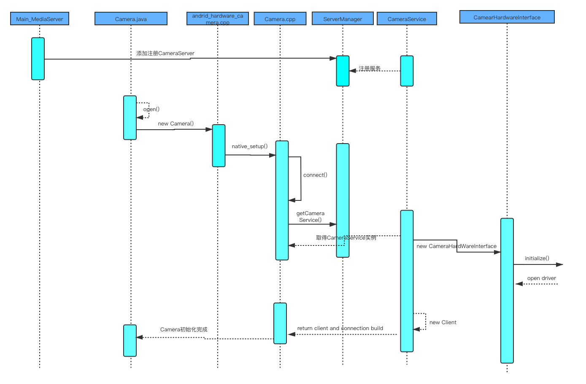

# 背景
微信支付业务功能实现依托于Android Camera，为了能快速着手相关的业务开发需要快速掌握Camera原理。
# 一、相机子系统基本分层
相机子系统从上到下可以分为4层：
1. 应用层：以Java的Camera类为主，为相机应用提供操作相机的接口。
2. Framework层：以C++的CameraService类为主，是应用层和HAL层通信的桥梁。
3. HAL层：硬件抽象层，以CameraHardwareInterface.h为主，规定硬件层的虚拟方法，具体实现要看各个系统对抽虚拟方法的实现。
4. 驱动层：以V4L2驱动程序为主，直接与摄像头通信。

 
 
HAL层出现的意义在于向上提供了统一接口，针对不同硬件平台只需替换HAL的实现，不用更改上层的API的调用逻辑。层级之间是通过什么来通信的呢？
应用层与Framework层之间通过Binder进行通信，系统开机初始化的时候会开启一个CameraService守护进程，为上层应用提供Camera对应的功能接口。Framework与硬件抽象层之间通过回调函数的方式来传递数据。
抽象层位于用户空间，驱动层位于内核空间，他们的通信要通过系统调用如open()、read()、ioctl()等进行数据传递。
# 二、相机初始化
CameraService在系统启动时new了一个实例，以“media.camera”为名字注册到ServiceManager中。应用层的Cammear.java 调用open方法进入Native的世界，
在ServiceManager中找到CameraService的Binder代理，调用CameraService的connect方法实例化HAL接口hardware，hardware调用initialize进入HAL层打开Camear驱动。CameraService::connet()返回client的时候，就表明客户端和服务端连接建立。相机完成初始化，可以进行拍照和preview等动作。一个看似简单的Camera初始化过程，经历了好几层的调用。java->JNI->Binder IPC->系统调用(open)。
 
# 三、相机预览
初始化Camera后开始预览取景preview。所有拥有拍照功能的应用，它在预览的时候都要实现SurfaceHolder.Callback接口，并实现其surfaceCreated、surfaceChanged、surfaceDestoryed三个函数。同时声明一个用于预览的窗口SurfaceView，还要设置Camera预览的surface缓冲区，以供底层获取的preview数据可以不断放入到surface缓冲区内。设置好以上参数后，就可以调用startPreview方法进行取景预览。startPreview()也是一层层往下调用，最后到达CameraService。相机应用--->Camera.java(框架)--->android_hardware_camera.cpp(JNI)--->Camera.cpp(客户端)--->CameraService.cpp(服务端)--->CameraHarwareInterface(HAL接口)。  
### HAL四个Callback
Framework层与HAL层是通过回调进行通信的，CameraHardWareInterface.h定义了CameraServece和CameraHAL之间的接口，在这个头文件中定义了四个回调函数：
1. camera_request_memory: Camera HAL通知CameraService申请buffer，其中的参数buf_size指定了buf大小，num_bufs指定buf数目，
2. camera_notify_callback: 用来传递一些消息：如快门消息、自动对焦完成消息、出错消息、拍照编码结束等
3. camera_data_callback: 用于Camera HAL返回数据，返回的数据可以是preview的数据帧或者preview的元数据也可以是jpeg格式的帧数据。其中参数data指定返回的图像数据（指针地址），metadata指定返回图像的元数据（指针地址）。
4. camera_data_timestamp_callback: 用来从Camera HAL返回帧数据以及对应的时间戳，这个callback用在录像的场景。其中参数timestamp表示生产帧数据的时间戳，msg_type固定为CAMERA_MSG_VIDEO_FRAME(录像类型)，data指向帧数据地址。

### CameraService与CameraHAL通信过程
client与server连接成功后就会new一个client返回，在client的构造函数中，对Camera设置了notifyCallback、dataCallBack、dataCallBackTimestamp三个回调函数，用于返回底层数据。preview方法调用后，CameraService在startPreviewMode方法中为CameraHAL指定一个预览窗口然后让CameraHAL调用startPreView(),最后通过回调函数源源不断的将数据投递到surfaceview的缓冲区中。因为preview的数据是比较大的，所有数据不会携带着传到上层，而是直接在两个缓冲区之间copy。(一个是底层采集数据的缓冲区，另一个是用于显示的surfaceview缓冲区)。

### CameraHAL与驱动通信过程
CamerHAL的startPreview主要完成三项任务，cameraPreviewConfig()、cameraPreviewStar()、开启两个存取buf队列线程。
1. cameraPreviewConfig,配置预览图像参数：CameraOpen()打开设备节点(/dev/video0)后，可以通过S_FMT（ioctl指令）设置图像像素格式，将数据由硬件抽象层传递到v4l2驱动。或者通过G_FMT得到图像像素格式，将数据由底层驱动返回至硬件抽象层。也可以，通过S_PARM，实现对相机硬件的控制。
2. cameraPreviewStar,开启预览实际上配置了内存：可以通过REQBUFS(ioctl指令)，系统会调用dma_alloc_coherent()为camera申请一段连续的dma内存。通过QUERYBUF询问内存，将申请到的内存物理地址，虚拟地址等数据从内核空间传递到用户空间。通过QBUF将询问得到的buf加入到队列。
3. 开启PreviewShowFrameThread和PreviewShowFrameThread：PreviewShowFrameThread通过DQBUF，从队列中取出一个buf数据(一帧数据)。如果相机硬件没有采集到图片，这个线程会在DQBUF过程中阻塞。PreviewShowFrameThread显示一帧数据，通过回调函数，将采集到的图像数据传回CameraService，再由CameraService传递给上层应用。（在预览过程中，CameraService会将数据copy一份到SurfaceFlinger，而不会往上层应用传递）。

 

# 四、USB摄像头

# 总结

<!-- # 透过现象看本质
1. 打开相机为什么能看到预览影像？
2. 相机应用调整参数是如何影响摄像头的？
3. 按下拍照键的时候发生了什么？ -->
